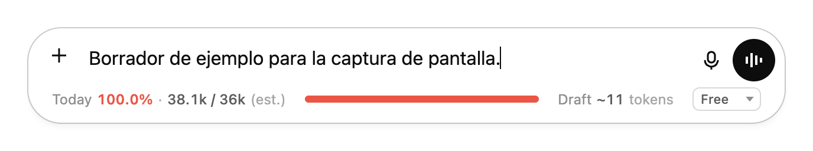
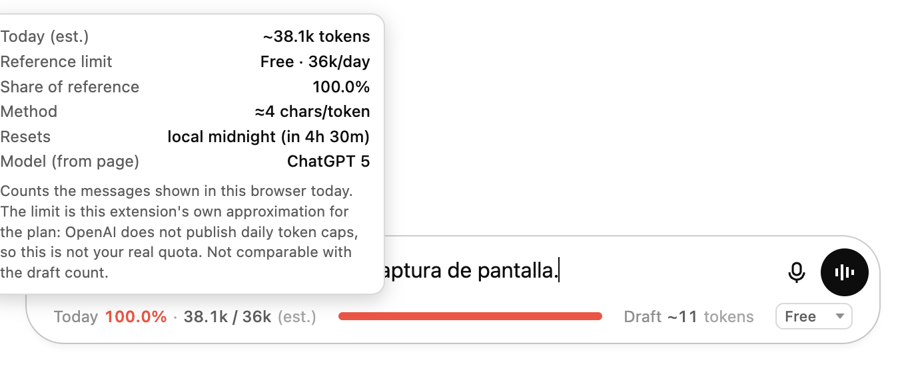
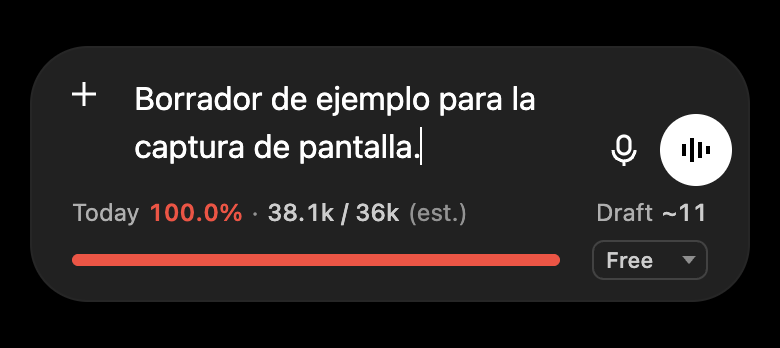

# ChatGPT Counter

> Repositorio: `chatgpt-token-counter` · La extensión aparece en Chrome como **ChatGPT Counter**.

Extensión de Chrome (Manifest V3) que añade una **barra de uso dentro del propio cuadro de mensaje de
[chatgpt.com](https://chatgpt.com)**: cuenta en vivo los tokens del borrador que estás escribiendo y lleva
una estimación del consumo del día frente a una referencia aproximada del plan. No necesita servidor, ni
proceso de compilación, ni dependencias, ni clave de API.



> **Léelo antes de fiarte de los números.** OpenAI no publica ningún límite diario de tokens. El total del
> día es una **estimación** (≈ 4 caracteres por token) medida contra una **referencia propia de esta
> extensión**, no contra la cuota real de tu cuenta. El contador del borrador sí usa el tokenizador real
> `o200k_base`. Son dos métricas distintas y la barra nunca las suma ni las compara. Detalles en
> [Limitaciones](#limitaciones).

## Qué muestra

La barra ocupa una fila propia en la parte inferior de la tarjeta del compositor, debajo de los botones
nativos:

```
Today 0.8% · 12.3k / 1.5M (est.)   ██░░░░░░░░░░░░░░   Draft ~1.2k tokens   [Plus ▾]
```

| Elemento | Qué es | Tipo de dato |
|---|---|---|
| **Today N% · usado / límite (est.)** y la barra | Tokens contados hoy en las conversaciones abiertas en este navegador (≈ 4 caracteres por token), como porcentaje de la referencia aproximada del plan que elijas. | Estimación sobre una referencia aproximada |
| **Draft ~N tokens** | El texto que llevas escrito, contado en vivo con el tokenizador real `o200k_base`. Solo muestra `(est.)` si el tokenizador no estuviera disponible y se recurre a la regla de 4 caracteres. | Exacto para esa codificación |
| **Selector de plan** | Free / Go / Plus / Pro: elige la referencia que usa la barra diaria. Se recuerda entre sesiones. | Ajuste |

No hay cifras de «sesión» ni «semana»: ChatGPT no expone ninguna fuente fiable para eso, así que la
extensión no las inventa. Al pasar el ratón por cada zona aparece el detalle (método, límite de
referencia, porcentaje, cuándo se reinicia la cuenta y el modelo leído de la página).



La barra cambia de color según el porcentaje: neutro → ámbar → rojo, y aparece un punto verde mientras
ChatGPT está generando. Nunca tapa un botón nativo: es una fila independiente y, en compositores
estrechos, pasa a dos líneas en lugar de encoger nada.



## Características

- **Contador del borrador en vivo** — se actualiza al escribir, pegar y borrar, con el tokenizador real
  `o200k_base` (emoji, unicode y texto que *parece* un token especial se tratan como texto normal).
- **Acumulado diario** — suma los mensajes que aparecen después de abrir cada conversación y se reinicia
  solo a medianoche local. El historial que ya estaba en pantalla nunca se cuenta.
- **Detección del modelo** — la etiqueta del modelo se lee de la página y se muestra en el detalle diario.
- **Selector de plan** — Free / Go / Plus / Pro cambia la referencia y los umbrales de color.
- **Se reancla solo** — si React vuelve a crear el compositor, la barra se reinserta; nunca hay más de una.
- **Sin configuración** — sin clave de API, sin cuenta, sin ajustes.

## Compatibilidad

| | |
|---|---|
| Navegador | Google Chrome y navegadores basados en Chromium (Edge, Brave, Arc, Opera) |
| Manifest | **Versión 3** |
| Versión mínima de Chrome | 111 (por la clave `world` de los *content scripts*) |
| Sitio | `https://chatgpt.com/*` únicamente |
| Firefox | No compatible: su implementación de Manifest V3 difiere |

## Instalación

Esta extensión **se carga tal cual, sin compilar nada**. El `manifest.json` está en la raíz del
repositorio, así que la carpeta que hay que seleccionar en Chrome es **la raíz del repositorio**.

1. Descarga el código:
   - **Opción A (ZIP):** pulsa `Code` → `Download ZIP` en GitHub y descomprime el archivo.
   - **Opción B (Git):**
     ```bash
     git clone https://github.com/Carlosandp/chatgpt-token-counter.git
     ```
2. Abre `chrome://extensions/` en Chrome.
3. Activa **Modo de desarrollador** (interruptor arriba a la derecha).
4. Pulsa **Cargar descomprimida** (*Load unpacked*).
5. Selecciona la carpeta **`chatgpt-token-counter`** — la que contiene directamente `manifest.json`,
   `icons/` y `src/`. No selecciones `src/` ni ninguna subcarpeta.
6. Abre [chatgpt.com](https://chatgpt.com). Si ya la tenías abierta, recarga la pestaña.

La barra aparece dentro del cuadro de mensaje en cuanto la página termina de cargar.

## Uso

- **Escribe en el cuadro de mensaje**: `Draft ~N tokens` se actualiza mientras escribes.
- **Elige tu plan** en el desplegable de la derecha de la barra. La elección se guarda y determina contra
  qué referencia se calcula el porcentaje diario y cuándo la barra se pone ámbar o roja.
- **Pasa el ratón** por la zona izquierda (acumulado) o por `Draft` para ver el detalle: método de conteo,
  caracteres, límite de referencia y cuánto falta para el reinicio de medianoche.
- El acumulado se reinicia solo a las 00:00 de tu hora local, incluso con la pestaña abierta.

## Estructura del proyecto

```
manifest.json                    Manifest V3; content scripts y permisos
icons/                           Iconos 16 / 48 / 128
docs/                            Capturas usadas en este README
src/
├── vendor/o200k_base.js         Tokenizador gpt-tokenizer (ver THIRD_PARTY_NOTICES.md)
└── content/
    ├── constants.js             Límites de referencia por plan y umbrales de color
    ├── daily.js                 Estado del acumulado diario (sin DOM); publica cambios por suscripción
    ├── main.js                  Conteo diario, navegación SPA y almacenamiento
    └── composer/                La barra dentro del cuadro de mensaje
        ├── tokens.js            Conteo del borrador y formato de cifras
        ├── selectors.js         Único archivo que conoce el DOM de ChatGPT
        ├── bar.js / bar.css     La barra, el selector de plan y los tooltips
        └── index.js             Observadores, reanclaje y actualización
tests/
├── tokens.test.mjs              Pruebas unitarias del conteo y el formato
└── e2e/                         Pruebas en Chrome real (ver más abajo)
```

### Cómo se mantiene anclada la barra

`selectors.js` localiza el editor (`#prompt-textarea`, con respaldo por `role="textbox"` y
`contenteditable`) y el punto de inserción: el final de `[data-composer-surface]`, la tarjeta redondeada
del compositor, que es una cuadrícula. La barra se coloca como fila de ancho completo (`grid-row: -1`),
así que queda debajo del cuerpo sea cual sea su plantilla. Si ese atributo desapareciera, un respaldo
estructural busca la tarjeta por su aspecto (ancestro redondeado y con fondo) sin depender de ninguna
clase; las clases de Tailwind de ChatGPT nunca se usan como anclaje.

Un único `MutationObserver` sobre `<body>` (con *throttle*) reinserta **el mismo** elemento cuando React
recrea el compositor, y un segundo observador sobre el editor sigue el borrador. Si ningún anclaje
encaja, la barra simplemente no se dibuja y el conteo diario sigue funcionando.

## Privacidad

- No hace ninguna petición de red propia. Nada sale de tu navegador.
- Solo se ejecuta en `https://chatgpt.com/*`. Sin `host_permissions` y sin `<all_urls>`.
- Sin analítica, sin telemetría, sin identificadores.
- Único permiso: `storage`, para recordar el total del día y el plan elegido.
- No guarda el texto de tus mensajes: solo dos números (el acumulado del día y el plan).

## Limitaciones

- **No existe un límite diario oficial.** Los valores de `constants.js` (36k / 360k / 1,5M / 5M) son una
  referencia propia, razonada a partir de las cuotas de mensajes publicadas. No son la cuota de tu cuenta
  y pueden quedar desfasados si OpenAI cambia sus planes.
- **El acumulado es una estimación de 4 caracteres por token**, deliberadamente distinta del contador del
  borrador. Los límites de referencia están calibrados contra esa regla, así que las dos cifras no son
  intercambiables.
- **El borrador no incluye** el historial de la conversación, los archivos adjuntos ni las instrucciones
  del sistema, que ChatGPT sí envía. El consumo real de entrada es mayor en conversaciones largas.
- **Solo ve esta pestaña y este navegador.** No cuenta el uso desde el móvil, otros navegadores ni la API.
- **Depende del DOM de ChatGPT.** Todo lo que conoce ese DOM está en `src/content/composer/selectors.js`.
  Si OpenAI cambia el marcado, la barra puede dejar de mostrarse hasta que se actualicen los selectores.

## Desarrollo

No hay compilación. Edita los archivos, pulsa **Actualizar** en `chrome://extensions/` y recarga la
pestaña de ChatGPT.

```bash
npm test                          # pruebas unitarias (Node >= 20, sin dependencias)
node tests/e2e/chatgpt-e2e.mjs    # pruebas en Chrome real (ver abajo)
```

No añadas `node_modules` dentro de esta carpeta: Chrome rechaza las carpetas de extensión que contienen
nombres reservados que empiezan por `_`, presentes en algunos paquetes.

## Pruebas

Estas son las pruebas que existen en el repositorio y que se ejecutaron sobre esta versión.

### Unitarias — `npm test`

10 pruebas sobre `src/content/composer/tokens.js`, ejecutando el tokenizador vendorizado de verdad:
conteo exacto en `o200k_base`, texto vacío, cadenas que parecen tokens especiales, unicode, emoji y
código, degradación a la regla de 4 caracteres cuando el tokenizador falta o lanza una excepción, y
formato de cifras y duraciones.

**Resultado: 10/10 correctas.**

### End-to-end en Chrome real — `node tests/e2e/chatgpt-e2e.mjs`

Requiere Google Chrome instalado y Node ≥ 20; no necesita `npm install`. Lanza Chrome con un **perfil
temporal desechable** (nunca tu perfil personal), carga la extensión con `Extensions.loadUnpacked` por
CDP y ejecuta 36 comprobaciones: anclaje y unicidad de la barra, conteo del borrador contrastado contra
el tokenizador de referencia, acumulado diario y umbrales de color, persistencia del plan tras recargar
la página, reanclaje cuando el compositor se recrea o se elimina, navegación SPA, ausencia de bucles de
renderizado, tooltips, temas claro y oscuro y doce anchos de ventana entre 1280 y 320 px comprobando que
la barra nunca solapa un botón nativo ni provoca desbordamiento horizontal.

**Resultado: 36/36 correctas, sin errores de consola atribuibles a la extensión.**

En otro sistema operativo, indica la ruta del binario de Chrome:

```bash
CHROME=/ruta/a/google-chrome node tests/e2e/chatgpt-e2e.mjs
```

> Las pruebas E2E se ejecutan contra `tests/e2e/chatgpt-replica.html`, una réplica del compositor
> construida con el DOM y los estilos medidos en el sitio real y servida bajo `https://chatgpt.com`.
> El motivo es concreto: ChatGPT detecta la automatización (`navigator.webdriver`) y no hidrata la
> página, de modo que no es posible ejercitar el sitio real desde un navegador controlado. La réplica
> cubre maquetación, reanclaje, conteo y temas; **no** sustituye a una comprobación manual en el sitio
> real tras un cambio de marcado por parte de OpenAI.

## Licencia

[MIT](LICENSE). Este proyecto incorpora un archivo de terceros; su licencia está en
[THIRD_PARTY_NOTICES.md](THIRD_PARTY_NOTICES.md).

## Autor

Carlos Andres Duran Paredes — [@Carlosandp](https://github.com/Carlosandp)
